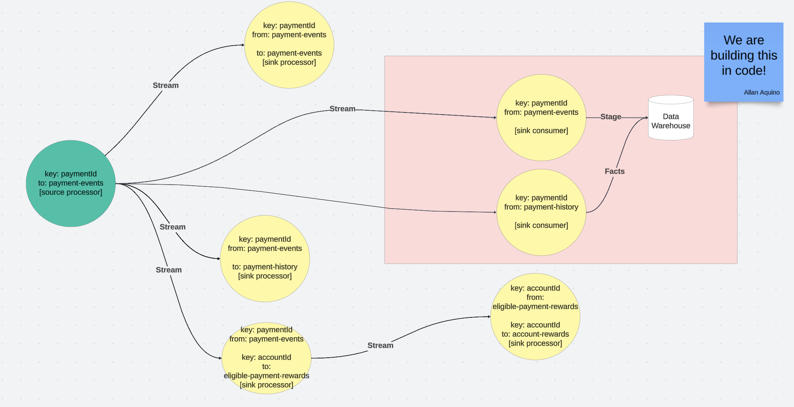

## Data Ingress

This service is the tutorial for this session. We are expected to create the following Topology that is defined in the shaded box below.

We are to create 2 sink processors with the following Topology.

| Sink Processor Name         | Consume From   | Consumes | Produce To | Produces | Description                                |
|-----------------------------|----------------|----------|------------|----------|--------------------------------------------|
| `sinkConsumerStagePayments` | payment-events | KStream  | N/A        | N/A      | Stores Events to an event staging table    |
| `sinkConsumerPaymentFacts`  | payment-events | KStream  | N/A        | N/A      | Consumes events and converts them to Facts |

If you have not read it, read through [payments-api](../payments-api/README.md) to have an idea of how the application can use Kafka.

Instead of explaining again, this `README` focuses on hints to get you to try to change the implementation.

### The Walkthrough

1. Open the class file `zip.meetup.streams.consumers.SinkConsumerStagePaymentsService` which contains the consumer for a payment event.
2. Open the class file `zip.meetup.streams.consumers.SinkConsumerPaymentFactsService` which contains the consumer for events converting it to a Fact
3. A `postgres` database serves as the `data warehouse` for this project, but it could be any RDBMS or DW tool of choice
