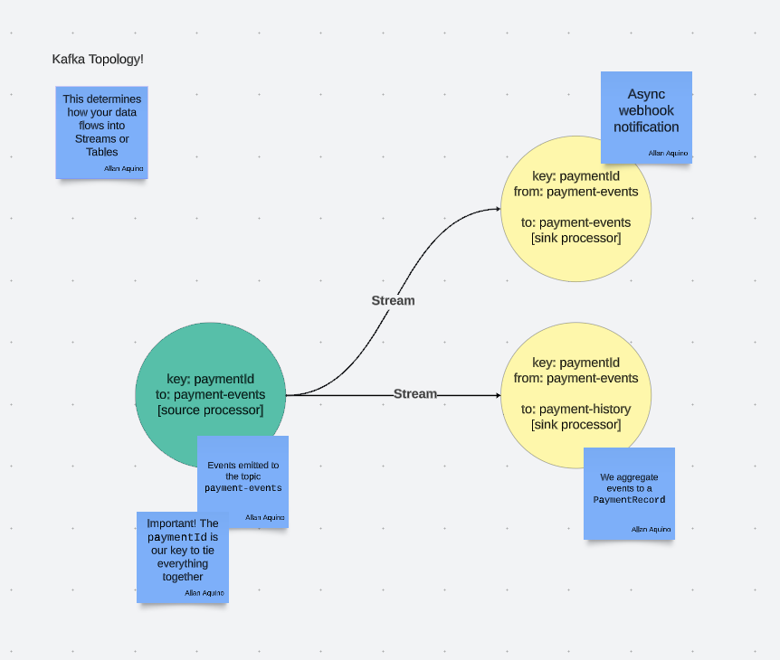
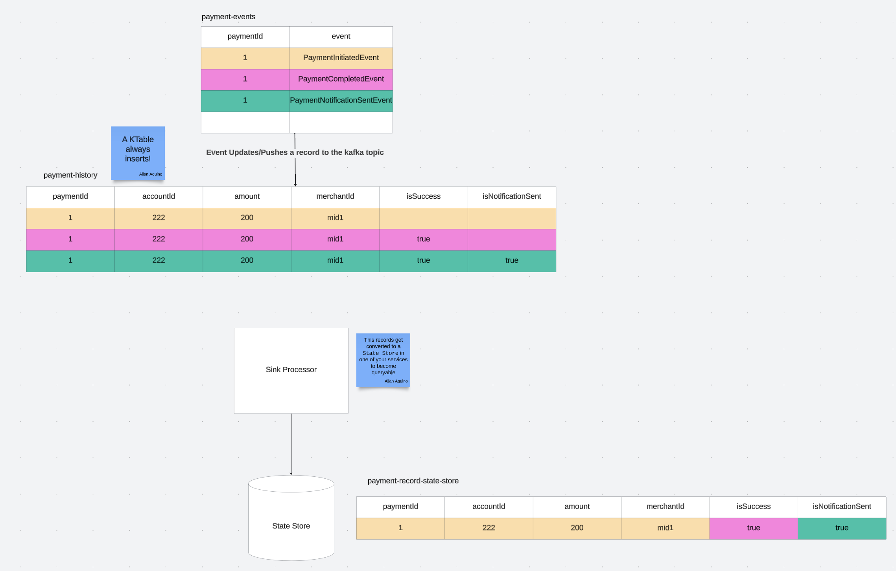

## Payments API

This service is an example of a service that produces events.

### Project structure

```text
payments-api
+--- src
     \--- main
          \--- kotlin
          \--- resources
```

## src/main/kotlin

The main application code is here. In order to run the service, run the command below:

```shell
./gradlew payments-api:bootRun
```

## How To Use

### Making a Payment

This can be done by doing the API call below. You can also refer to `/zip-meetup-tutorial/.api-test/payments.http` to see example API
calls.

#### API Request

```http request
### Make a Payment
POST http://localhost:8085/payment
Content-Type: application/json

{
  "accountId": "222",
  "amount": 200,
  "merchantId": "mid1"
}
```

#### API Response

```json
{
  "accountId": "222",
  "amount": 200,
  "paymentId": "1700000449",
  "merchantId": "mid1"
}
```

### Get Payments

Retrieving the payments by account ID. This is not stored in a database, it is stored in a local state store that is running in the same instance.

#### API Request

```http request
### Query by account - payments
GET http://localhost:8085/payment?account_id=222
```

#### API Response

```json
[
  {
    "paymentId": "1700000449",
    "accountId": "222",
    "amount": 200,
    "merchantId": "mid1",
    "isSuccess": true,
    "isNotificationSent": true
  }
]
```

## Application Topology

This application does not use a database to store its data, it uses the state store to project the events that has occurred to a single data model
that encapsulates the information from the events that have happened.

This is the Topology of the `payments-api` application. This has 2 different processors.

A `source processor` which generates the events for `PaymentInitiatedEvent` and `PaymentCompletedEvent` as a `Payment` occurs.

There are 2 `sink processors` which consumes events from the `source processor` and deals with events to handle another side effect. It also deals 
with creating the `state store` for each payment that happens.

To know more about Topologies check it out here in 
[Confluent's Stream Architecture Document](https://docs.confluent.io/platform/current/streams/architecture.html).



### Source Processor

The source generates 2 messages for `POST /payment` call.

#### Setting up the message publishing when we receive a `POST /payment` call

```yaml
spring:
  kafka:
    properties:
      # This is your bootstrap server location of Kafka
      # Running the docker container in this project would have the default settings as you see below
      bootstrap.servers: ${KAFKA_BOOTSTRAP_SERVERS:localhost:9092}
      schema.registry.url: ${KAFKA_SCHEMA_REGISTRY_URL:http://localhost:8081}
      auto.register.schemas: true
      # This is the Exactly-Once-Semantics (EOS), recommend turning this on, for more info look
      # at Confluent's documentation on this
      processing.guarantee: exactly_once_v2
      # We assign all state stores to write into this directory
      state.dir: /tmp/kafka-streams
    
    producer:
      properties:
        # We configure our producer to serialize the keys as `String`
        # Payment IDs in this case are in `String` format
        key.serializer: org.apache.kafka.common.serialization.StringSerializer
        # We configure our producer to serialize the payload as any AVRO format
        value.serializer: io.confluent.kafka.serializers.KafkaAvroSerializer
        # We make sure that the producer can understand that formats of the messages can be
        # multiple shapes in the topic a specific producer is talking to
        # This can be overridden, if we wish to via the spring.cloud.stream.kafka.streams.bindings
        value.subject.name.strategy: io.confluent.kafka.serializers.subject.RecordNameStrategy
        retries: 3
        acks: -1
  
  cloud:
    stream:
      bindings:
        # This is our sourceProcessorPaymentEvents, the producer of the Payment Events
        # We typically have this in an `EventPublisherService` class
        # Spring's binder naming convention is normally the {beanName}-{in/out}-#
        # The beanName is the name of your singleton
        # The `in` is whether it is consuming, the `out` is for producing
        # The `#` is more of an indicator if you have are consuming or producing from/to multiple streams
        sourceProcessorPaymentEvents-out-0:
          # The name of the topic in Kafka
          destination: payment-events
          # The format of the payload we send through
          content-type: application/*+avro
          # We normally only need the use-native-encoding
          # In production, Kafka's partitions should be set-up separate from the code
          producer:
            use-native-encoding: true
            partition-count: 2
            
    function:
      # This is the singleton assigned to publishing events to the Kafka Topic which we just setup
      # This is typically a @Bean of a `Supplier`
      # Refer to zip.meetup.services.EventPublisherServiceImpl.sourceProcessorPaymentEvents in this project
      # To see how it is implemented
      definition: sourceProcessorPaymentEvents
```

### Sink Processor -- Payment Record State Store

The `sink processor` that consumes from `payment-events` and produces the record to `payment-history` creates the state store for each payment record.

#### Setting up the sink processor that generates the `KTable`

```yaml
spring:
  kafka:
    consumer:
      properties:
        # Similar to the earlier setup for producer, we expect to receive messages in the same manner
        key.deserializer: org.apache.kafka.common.serialization.StringDeserializer
        value.deserializer: io.confluent.kafka.serializers.KafkaAvroDeserializer
        value.subject.name.strategy: io.confluent.kafka.serializers.subject.RecordNameStrategy

  cloud:
    stream:
      bindings:
        # This is setting where we receive the messages from for this sink processor
        # Spring's binder configuration 
        # We follow the same naming convention as `{beanName}-in-0`, like how it was with the producer
        # Except this time it is `in`
        sinkProcessorPaymentRecords-in-0:
          # We are consuming messages from this Topic in Kafka
          destination: payment-events
          # This is the same format we set earlier
          content-type: application/*+avro
          consumer:
            # This is an equivalent setting for use-native-encoding, but for consuming
            use-native-decoding: true
            concurrency: 2
            
        # For each message received, it will then send a message to another topic which serves as
        # the records of all payments
        sinkProcessorPaymentRecords-out-0:
          # It looks similar to a sourceProcessor, except that this time we are going to be
          # using the same singleton to produce the message and not even call the `EventPublisherService`
          # to publish to Kafka
          destination: payment-history
          content-type: application/*+avro
          producer:
            use-native-encoding: true
            partition-count: 2
            
      kafka:
        streams:
          bindings:
            # This is a configuration to this sink processor to identify it as a having a single
            # AVRO shape being produced to the Kafka topic that we configured it to earlier
            sinkProcessorPaymentRecords-out-0:
              producer:
                configuration:
                  value.subject.name.strategy: io.confluent.kafka.serializers.subject.TopicNameStrategy
                  
          binder:
            functions:
              sinkProcessorPaymentRecords:
                # This is the consumer group name that every consumer has
                # This allows the Kafka Broker to identify which message a consumer group is up to
                # so that it will not reprocess a message all of a sudden
                application-id: processor-payment-history-v1.0

    function:
      # We add `sinkProcessorPaymentRecords` to the definition to enable it
      # We configured the other sourceProcessor earlier
      definition: sourceProcessorPaymentEvents;sinkProcessorPaymentRecords

        # Refer to `zip.meetup.streams.processors.SinkProcessorPaymentRecordsService.sinkProcessorPaymentRecords` to see how this function is 
        # implemented
```

### Sink Processor -- Webhook Notification

The `sink processor` that consumes from `payment-events` and produces the record to `payment-events`, its purpose is to send a webhook notification 
after a `PaymentCompletedEvent` is consumed. It then produces `PaymentNotificationSentEvent` after sending it successfully.

#### Setting up the asynchronous webhook notification sink processor and emitting a new event from it

As you progress through this document, we are omitting the configurations we have set from before.

```yaml
spring:
  cloud:
    stream:
      bindings:
        # Similar to before, we are receiving messages from the same Kafka Topic
        # However, this sink processor "sends" a message to a webhook that is configured to the merchant here
        # It then publishes that it has successfully sent a message back to the same topic
        sinkProcessorNotifications-in-0:
          destination: payment-events
          content-type: application/*+avro
          consumer:
            use-native-decoding: true
            concurrency: 2
            
        # The main difference of this sink processor is that it publishes a new message to the same topic it is consuming from
        # This remains to be a KStream
        sinkProcessorNotifications-out-0:
          destination: payment-events
          content-type: application/*+avro
          producer:
            use-native-encoding: true
            partition-count: 2
            
      kafka:
        streams:
          binder:
            functions:
              # Like before, we assign a consumer group name to this sink processor
              sinkProcessorNotifications:
                application-id: processor-notifications-v1.0

    function:
      # We add `sinkProcessorNotifications` to the definition to enable it
      definition: sourceProcessorPaymentEvents;sinkProcessorPaymentRecords;sinkProcessorNotifications

        # Refer to `zip.meetup.streams.processors.SinkProcessorNotificationsService.sinkProcessorNotifications` to see how this function is 
        # implemented
```

### How it all works together

The image below shows you how an event affects each `Topic`, any message that is produced is always inserted.

Following the color code below, the `yellow` event shows you the effect on the topic as an `event` occurs. This initializes the record in the 
`state store`, and the `isSuccess` and `isNotificationSent` remains `null` as the `event` has not occurred yet.

The `red` event shows you the effect on `payment-history` as well, updating the `isSuccess` to `true`. Consequently, the `state store` will also have 
the value updated for `isSuccess` to `true` and `isNotificationSent` remains `null`.

The `green` event shows you the effect on `payment-history` similar to how `isSuccess` has updated both `Topics`.

The end result is that the `PaymentRecord` has consumed all the events and is the data model we have designed earlier.


