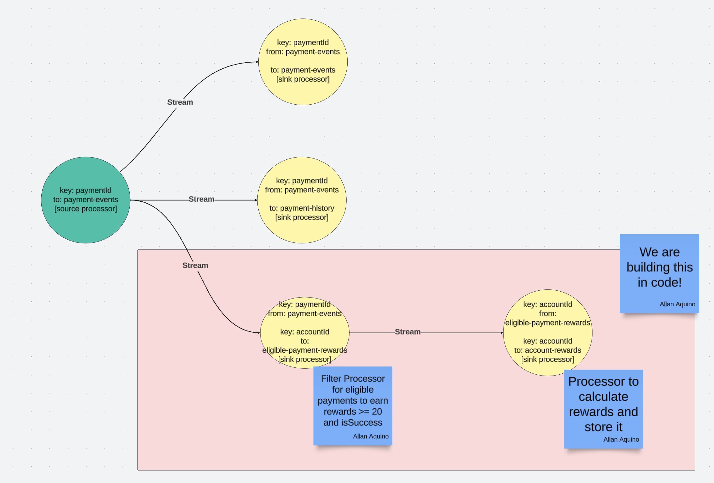

## Rewards API

This service is the tutorial for this session. We are expected to create the following Topology that is defined in the shaded box below.

We are to create 2 sink processors with the following Topology.

| Sink Processor Name                   | Consume From             | Consumes | Produce To               | Produces | Description                                                                                        |
|---------------------------------------|--------------------------|----------|--------------------------|----------|----------------------------------------------------------------------------------------------------|
| `sinkProcessorEligiblePaymentRewards` | payment-events           | KStream  | eligible-payment-rewards | KStream  | Node is only interested in events that are `PaymentCompleteEvent`, `successful` and `amount >= 20` |
| `sinkProcessorAccountRewards`         | eligible-payment-rewards | KStream  | account-rewards          | KTable   | Node calculates the total rewards per account ID                                                   |

If you have not read it, read through [payments-api](../payments-api/README.md) to have an idea of how the application can use Kafka.

Instead of explaining again, this `README` focuses on hints to get you to try to change the implementation.

### The Walkthrough

1. Check and play around how the `sinkProcessorEligiblePaymentRewards` and `sinkProcessorAccountRewards` are configured.
2. Follow the implemented sink processors in the [implementation](./src/main/kotlin/zip/meetup/streams/processors/SinkProcessorAccountRewardsService.kt)
3. Play around with the [API calls](../.api-test), to run the rewards-api run `./gradlew rewards-api:bootRun`
4. Change the implementation by changing the consumer group names in `application.yaml`

### Last Notes

Kafka is really hard to grasp in the beginning, but a bootstrapped code really helps a lot in understanding what and how one can use it.
The goal of this shared project is to hopefully help anyone keen to pick it up.

It's also not the end of the world, if you wish to communicate, open up a PR, and maybe I can help you out!

Thank you for letting me help you walk through this code like this. :)
